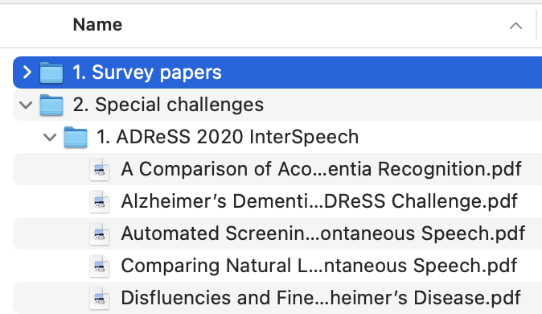

# Awesome Paper List Generator

> Generate markdown paper list from PDF files. Get paper info automatically from online resources.

## Usage
1. Put your papers into folders, where folders stand for categories. Try to name your paper file as "paper title".pdf. If the filename is not a paper title, it is still OK for most cases. Our program will try to get the paper title from the PDF files, although it may failed sometimes.

2. Run the program
```
$ python generate.py --paper_dir "/your/paper/dir"
```
3. Check paper.md file

## Example 

[awesome-dementia-detection](https://github.com/billzyx/awesome-dementia-detection)

## Other parameters

- --output_md Output markdown file path
- --header_start_index Start index of headers
- --before_md Markdown file before the paper section
- --after_md Markdown file after the paper section

## Acknowledgements

Some code forked from https://github.com/danielnsilva/semanticscholar
